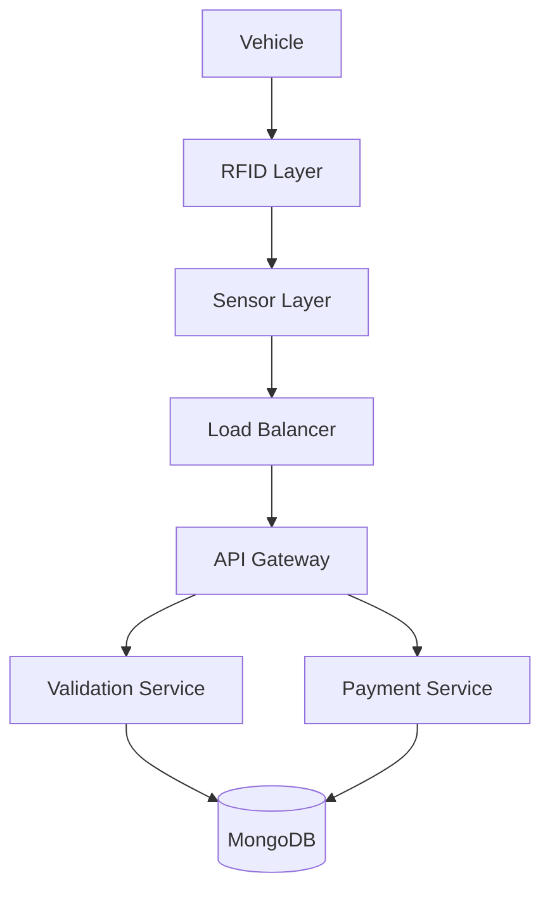

  <h1> Smart Toll Collection System Simulator</h1>
  <p>A distributed systems mini-project simulating a FASTag-like electronic toll collection platform.</p>


---

##  Overview
The **Smart Toll Collection System Simulator** is a comprehensive web application designed to demonstrate the architecture, failure handling, and real-time processing capabilities of a modern toll collection system. It simulates vehicle entry, RFID validation, automated payment deduction, and various system failures in a controlled, beginner-friendly environment.

##  Problem Statement
Designing a real-time toll collection system requires handling thousands of concurrent requests, ensuring data consistency during network failures, and providing fallback mechanisms for incorrect detections or payment timeouts. This project simulates these challenges to understand distributed system design practically.

##  Features
- **Real-Time Dashboard**: Monitor system health, revenue, and recent logs.
- **Vehicle Detection Simulation**: Test valid, invalid, duplicate, and blacklisted RFID scans.
- **Payment Processing**: Automated deductions with manual payment fallbacks (Cash/UPI/Card).
- **Failure Injection**: Simulate server crashes, network delays, sensor failures, and fraud attempts.
- **Analytics**: Visualize revenue trends and failure distributions.

##  Tech Stack
- **Frontend**: HTML5, CSS3, Vanilla JavaScript, Chart.js, Mermaid.js
- **Backend**: Python 3, Flask
- **Database**: MongoDB (PyMongo)
- **Utilities**: Faker (Dummy Data), python-dotenv

##  Folder Structure
```text
.
├── .env
├── .env.example
├── .gitignore
├── README.md
├── backend
│   ├── app.py
│   ├── database.py
│   ├── models.py
│   ├── routes.py
│   ├── sample_data.py
│   ├── services.py
│   └── utils.py
├── docs
│   ├── api.md
│   ├── architecture.md
│   ├── database.md
│   └── scalability.md
├── frontend
│   ├── analytics.html
│   ├── assets
│   │   ├── icons
│   │   ├── images
│   │   └── screenshots
│   │       ├── Screenshot 2026-05-19 at 2.34.35 PM.png
│   │       └── image.png
│   ├── css
│   │   └── style.css
│   ├── dashboard.html
│   ├── failure.html
│   ├── index.html
│   ├── js
│   │   ├── analytics.js
│   │   ├── app.js
│   │   ├── dashboard.js
│   │   ├── failure.js
│   │   ├── payment.js
│   │   └── vehicle.js
│   ├── payment.html
│   ├── system-design.html
│   └── vehicle.html
└── requirements.txt
```

##  Architecture
The system follows a modular architecture separating the presentation layer from the business logic and database.



##  Workflow
1. **Vehicle Entry** -> **Detection** -> **RFID Validation**
2. **Success Flow**: Payment Deducted -> Transaction Logged -> Barrier Open
3. **Failure Flow**: Insufficient Balance -> Manual Payment Prompt -> Retry Flow -> Logged

##  Failure Handling
The simulator can explicitly test 20 different failure scenarios, including:
- Invalid/Expired RFID
- Network Timeout / Database Disconnection
- Duplicate Scan Prevention
- Manual Payment Fallback for insufficient balance

##  Scalability & Distributed Concepts
- **Load Balancer**: Distributes incoming toll booth data.
- **Caching**: Simulates fast retrieval of blacklisted plates.
- **Queues**: Asynchronous processing of payment logs.
- **Fault Tolerance**: Retry mechanisms built into the failure simulator.

*(For detailed explanations, check `docs/scalability.md`)*

##  Screenshots
*(Add your screenshots here)*
- Dashboard View: `assets/screenshots/dashboard.png`
- Failure Simulation: `assets/screenshots/failure.png`

##  Installation & Running Locally

1. **Clone the repository**
   ```bash
   git clone https://github.com/your-username/smart-toll-simulator.git
   cd smart-toll-simulator
   ```

2. **Set up Virtual Environment**
   ```bash
   python -m venv venv
   source venv/bin/activate  # On Windows: venv\Scripts\activate
   ```

3. **Install Dependencies**
   ```bash
   pip install -r requirements.txt
   ```

4. **Environment Variables**
   Copy `.env.example` to `.env` and configure your MongoDB URI.
   ```bash
   cp .env.example .env
   ```

5. **Generate Dummy Data**
   ```bash
   python backend/sample_data.py
   ```

6. **Run the Server**
   ```bash
   python backend/app.py
   ```
   Open `http://localhost:5000` in your browser.

##  Special Q&A (From Problem Statement)

**Q1: How does the system ensure fast processing?**
**A**: By utilizing caching for hot data (like blacklists), asynchronous message queues for logging, and a load balancer to distribute the request load across multiple worker nodes.

**Q2: How are incorrect detections handled?**
**A**: The system implements duplicate scan prevention using time-windows and falls back to manual verification or camera backup when an RFID is unreadable.

**Q3: How are payment failures handled?**
**A**: If an automatic wallet deduction fails (e.g., timeout or insufficient balance), the system triggers a retry flow. If it still fails, it directs the operator to collect via a manual fallback method (Cash/UPI), ensuring no revenue is lost.

##  Learning Outcomes
- Understanding Distributed System patterns.
- Implementing RESTful APIs with Python Flask.
- Handling asynchronous state on the frontend.
- NoSQL Database design and querying with MongoDB.

##  Author
- **Sameer Rathod** - *Initial work* - [Your GitHub Profile](https://github.com/Whatisthissam)
