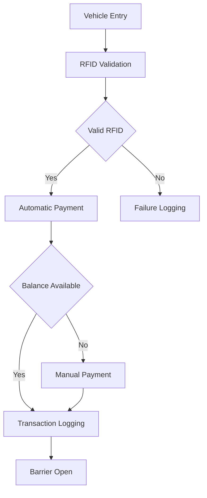
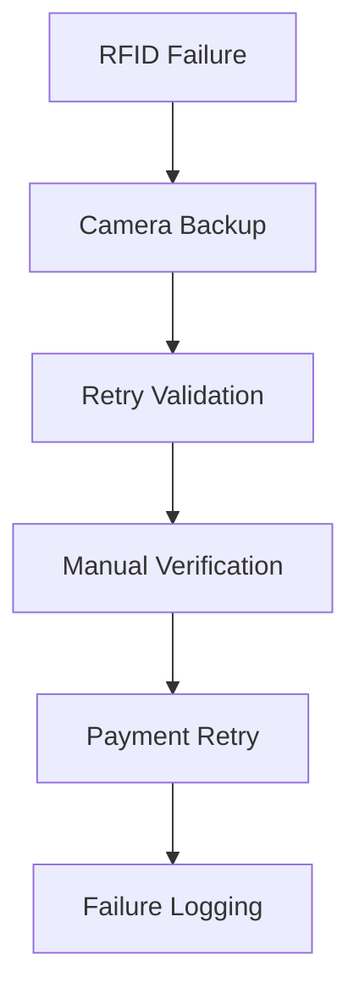

<h1>Smart Toll Collection System Simulator</h1>

<p>
A distributed systems mini-project simulating a FASTag-inspired electronic toll collection platform with payment handling, failure simulation, analytics, and scalability concepts.
</p> 

---

# Overview

The **Smart Toll Collection System Simulator** is a web-based simulation project designed to demonstrate how modern toll systems operate internally.

The project simulates:

- Vehicle Entry Detection
- RFID Validation
- Automatic Toll Deduction
- Manual Payment Fallback
- Transaction Logging
- Failure Recovery
- Dashboard Analytics
- Distributed System Concepts

The goal is to understand system design and real-time processing using a simplified academic implementation.

---

# Problem Statement

Modern toll systems process thousands of vehicles continuously.

A real system must:

- Validate RFID tags quickly
- Process transactions efficiently
- Prevent duplicate scans
- Recover from failures
- Handle large traffic volumes
- Maintain transaction consistency

This project recreates those scenarios through simulation.

---

# Objectives

- Simulate FASTag-style toll collection
- Understand distributed architectures
- Implement payment workflows
- Design APIs
- Simulate failures
- Create analytics dashboards
- Study scalability techniques
- Understand recovery mechanisms

---

# Features

## Dashboard Module

- Revenue Monitoring
- Vehicle Statistics
- Failure Count
- Transaction Logs
- System Health Overview

## Vehicle Detection Module

- RFID Validation
- Duplicate Detection
- Invalid RFID Handling
- Blacklisted Vehicle Detection

## Payment Module

- Automatic Toll Deduction
- Wallet Verification
- Manual Payment Support
- Retry Workflow

## Failure Simulation Module

- RFID Failure
- Network Delay
- Server Error
- Queue Delay
- Database Failure
- Fraud Detection

## Analytics Module

- Revenue Trends
- Success Rate Analysis
- Failure Distribution
- Vehicle Statistics

---

# Technology Stack

## Frontend

- HTML5
- CSS3
- JavaScript
- Chart.js
- Mermaid.js

## Backend

- Python
- Flask

## Database

- MongoDB
- PyMongo

## Utilities

- Faker
- python-dotenv
- UUID
- Datetime

---

# Folder Structure

```text
smart-toll-simulator/

│── frontend/
│
│   ├── index.html
│   ├── dashboard.html
│   ├── vehicle.html
│   ├── payment.html
│   ├── failure.html
│   ├── analytics.html
│   ├── system-design.html
│
│   ├── css/
│   │     └── style.css
│
│   ├── js/
│   │     ├── app.js
│   │     ├── dashboard.js
│   │     ├── vehicle.js
│   │     ├── payment.js
│   │     ├── failure.js
│   │     ├── analytics.js
│   │     └── systemdesign.js
│
│   └── assets/
│         ├── images/
│         ├── icons/
│         └── screenshots/
│
│── backend/
│   ├── app.py
│   ├── database.py
│   ├── models.py
│   ├── routes.py
│   ├── services.py
│   ├── utils.py
│   └── sample_data.py
│
│── docs/
│   ├── architecture.md
│   ├── api.md
│   ├── database.md
│   └── scalability.md
│
│── README.md
│── requirements.txt
│── .env.example
```

---

# Architecture Overview

The simulator follows a modular distributed architecture.

Layers:

- Detection Layer
- Validation Layer
- Payment Layer
- Logging Layer
- Analytics Layer

## Architecture Diagram


### Components

| Component | Responsibility |
|-----------|---------------|
| Vehicle | Vehicle Entry |
| RFID Simulator | FASTag Simulation |
| Sensor Layer | Detection |
| Load Balancer | Traffic Distribution |
| API Gateway | Routing |
| Validation Service | Verification |
| Payment Service | Deduction |
| Logging Service | Storage |
| Redis Cache | Fast Access |
| Queue System | Asynchronous Processing |
| MongoDB | Data Storage |
| Dashboard | Monitoring |

---

# Workflow Design

## Vehicle Processing Flow



### Success Flow

Vehicle Entry

↓

RFID Validation

↓

Wallet Verification

↓

Payment Success

↓

Transaction Logging

↓

Barrier Open

### Failure Flow

Vehicle Entry

↓

Invalid RFID

↓

Failure Logging

↓

Retry

↓

Manual Verification

↓

Manual Payment

---

# Failure Recovery Design



Supported scenarios:

- Invalid RFID
- Expired RFID
- Duplicate Scan
- Blacklisted Vehicle
- Payment Failure
- Queue Delay
- Network Failure
- Database Failure
- Sensor Failure
- Fraud Detection
- Retry Flow
- Camera Backup

---

# Database Design

## Vehicle Collection

| Field | Type |
|--------|------|
| vehicleNumber | String |
| ownerName | String |
| vehicleType | String |
| rfidTag | String |
| walletBalance | Number |
| isBlacklisted | Boolean |
| createdAt | Date |

## Transaction Collection

| Field | Type |
|--------|------|
| transactionId | String |
| vehicleNumber | String |
| rfidTag | String |
| amount | Number |
| paymentMethod | String |
| paymentStatus | String |
| failureReason | String |
| timestamp | Date |

## Failure Log Collection

| Field | Type |
|--------|------|
| failureId | String |
| failureType | String |
| description | String |
| vehicleNumber | String |
| retryCount | Number |
| timestamp | Date |

---

# API Design

```http
POST /api/vehicle/detect

POST /api/payment/process

POST /api/payment/manual

POST /api/payment/retry

POST /api/failure/simulate

GET /api/transactions

GET /api/vehicles

GET /api/dashboard

GET /api/analytics

GET /api/logs
```

---

# Scalability Concepts

The project demonstrates:

- Load Balancing
- API Gateway Routing
- Queue Processing
- Distributed Logging
- Retry Mechanisms
- Redis Caching
- Horizontal Scaling
- Fault Tolerance
- Rate Limiting
- Database Optimization

---

# Screenshots

Add screenshots inside:

```text
frontend/assets/screenshots/
```

Suggested screenshots:

- Dashboard
- Vehicle Detection
- Payment Module
- Failure Center
- Analytics
- System Design Page

---

# Installation Guide

Clone repository:

```bash
git clone https://github.com/Whatisthissam/smart-toll-simulator.git
```

Move into project:

```bash
cd smart-toll-simulator
```

Install dependencies:

```bash
pip install -r requirements.txt
```

Create environment file:

```bash
cp .env.example .env
```

Generate sample data:

```bash
python backend/sample_data.py
```

Run application:

```bash
python backend/app.py
```

Open:

```text
http://localhost:5000
```

---

# Deployment

Recommended platforms:

- Render
- Railway
- Mongo Atlas
- Docker
- Vercel (Frontend)

---

# Questions from Problem Statement

## Q1. How does the system ensure fast processing?

The simulator uses:

- Load Balancing
- Queue Processing
- Redis Caching
- Horizontal Scaling

These reduce response time and improve throughput.

## Q2. How are incorrect detections handled?

The system implements:

- RFID Validation
- Duplicate Prevention
- Camera Backup
- Manual Verification

This minimizes incorrect entries.

## Q3. How are payment failures handled?

Payment failures trigger:

1. Retry Mechanism  
2. Manual Fallback  
3. Failure Logging  
4. Dashboard Update  
5. Recovery Flow  

---

# Future Scope

Possible enhancements:

- Real RFID Integration
- FASTag APIs
- OCR Camera Detection
- Kafka Queues
- Cloud Deployment
- Multi-Toll Support
- Authentication System
- Live Payment Gateway

---

# Learning Outcomes

- Distributed Systems Design
- REST API Development
- MongoDB Modeling
- Failure Recovery
- Analytics Dashboards
- Scalability Concepts
- Logging Systems
- Payment Workflow Design

---

# Author

Sameer Rathod

GitHub: https://github.com/Whatisthissam
